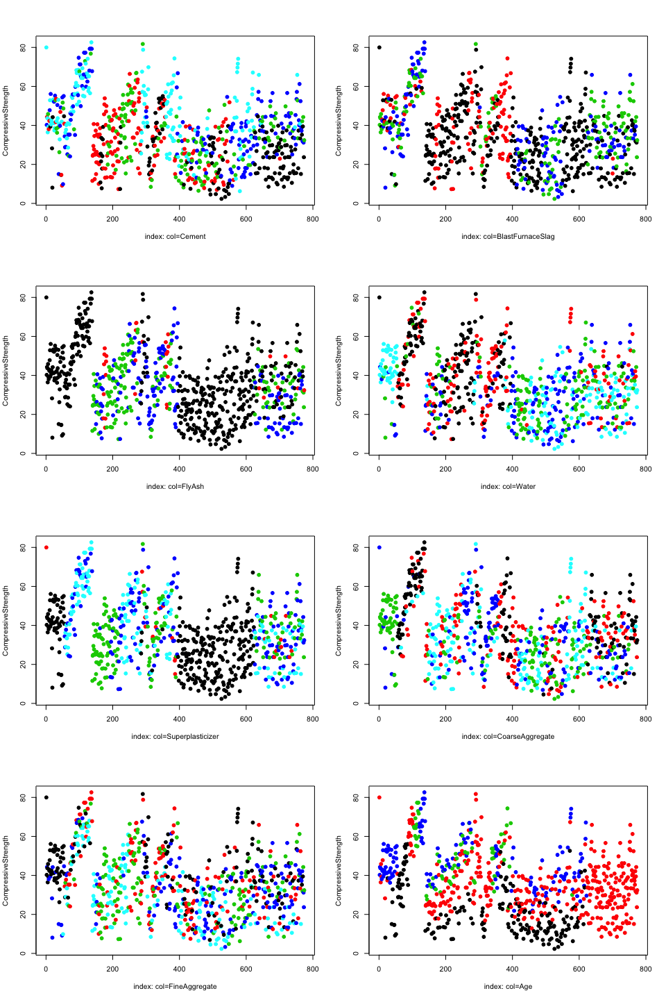
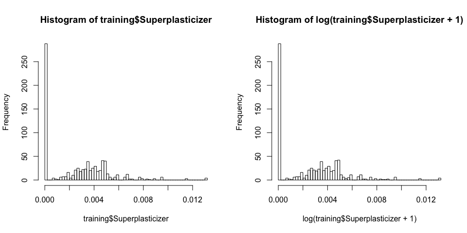

Tom Lous  
6 May 2016  


# Quiz 2
## Question 1

Load the Alzheimer's disease data using the commands:


```r
library(AppliedPredictiveModeling)
data(AlzheimerDisease)
```

Which of the following commands will create non-overlapping training and test sets with about 50% of the observations assigned to each?

### Answer


```r
adData = data.frame(diagnosis,predictors)
testIndex = createDataPartition(diagnosis, p = 0.50,list=FALSE)
training = adData[-testIndex,]
testing = adData[testIndex,]
```

and


```r
adData = data.frame(diagnosis,predictors)
trainIndex = createDataPartition(diagnosis,p=0.5,list=FALSE)
training = adData[trainIndex,]
testing = adData[-trainIndex,]
```

---

## Question 2

Load the cement data using the commands:


```r
library(AppliedPredictiveModeling)
data(concrete)
library(caret)
set.seed(1000)
inTrain = createDataPartition(mixtures$CompressiveStrength, p = 3/4)[[1]]
training = mixtures[ inTrain,]
testing = mixtures[-inTrain,]
```

Make a plot of the outcome (CompressiveStrength) versus the index of the samples. Color by each of the variables in the data set (you may find the cut2() function in the Hmisc package useful for turning continuous covariates into factors). What do you notice in these plots?

### Answer


```r
library(Hmisc)
cols <- colnames(training)
subCols <- cols[-length(cols)] #all but CompressiveStrength
plotCols = 2
par(mfrow = c(ceil(length(subCols)/plotCols), plotCols))
res <- sapply(subCols, function(colName){
  cut <- cut2(training[,colName])
  lab <- paste0("index: col=",colName)
  plot(training$CompressiveStrength, pch=19, col=cut, xlab=lab, ylab="CompressiveStrength")
})
```



---

## Question 3

Load the cement data using the commands:


```r
library(AppliedPredictiveModeling)
data(concrete)
library(caret)
set.seed(1000)
inTrain = createDataPartition(mixtures$CompressiveStrength, p = 3/4)[[1]]
training = mixtures[ inTrain,]
testing = mixtures[-inTrain,]
```

Make a histogram and confirm the SuperPlasticizer variable is skewed. Normally you might use the log transform to try to make the data more symmetric. Why would that be a poor choice for this variable?


### Answer


```r
par(mfrow = c(1,2))
hist(training$Superplasticizer, breaks = 50)
hist(log(training$Superplasticizer + 1), breaks = 50)
```



>There are a large number of values that are the same and even if you took the log(SuperPlasticizer + 1) they would still all be identical so the distribution would not be symmetric.

---

## Question 4

Load the Alzheimer's disease data using the commands:


```r
library(caret)
library(AppliedPredictiveModeling)
set.seed(3433)
data(AlzheimerDisease)
adData = data.frame(diagnosis,predictors)
inTrain = createDataPartition(adData$diagnosis, p = 3/4)[[1]]
training = adData[ inTrain,]
testing = adData[-inTrain,]
```

Find all the predictor variables in the training set that begin with IL. Perform principal components on these variables with the preProcess() function from the caret package. Calculate the number of principal components needed to capture 80% of the variance. How many are there?

### Answer


```r
IL_Colnames = grep("^IL", colnames(training), value=TRUE,ignore.case=TRUE)
pcaMod <- preProcess(training[,IL_Colnames], method="pca", thresh=0.9)
pcaMod
```

```
## Created from 251 samples and 12 variables
## 
## Pre-processing:
##   - centered (12)
##   - ignored (0)
##   - principal component signal extraction (12)
##   - scaled (12)
## 
## PCA needed 9 components to capture 90 percent of the variance
```

---

## Question 5

Load the Alzheimer's disease data using the commands:


```r
library(caret)
library(AppliedPredictiveModeling)
set.seed(3433)
data(AlzheimerDisease)
adData = data.frame(diagnosis,predictors)
inTrain = createDataPartition(adData$diagnosis, p = 3/4)[[1]]
training = adData[ inTrain,]
testing = adData[-inTrain,]
```

Create a training data set consisting of only the predictors with variable names beginning with IL and the diagnosis. Build two predictive models, one using the predictors as they are and one using PCA with principal components explaining 80% of the variance in the predictors. Use method="glm" in the train function.

What is the accuracy of each method in the test set? Which is more accurate?

### Answer


```r
createSet <- function(ds){
  IL_Colnames = grep("^IL", colnames(ds), value=TRUE,ignore.case=TRUE)
  ds[,IL_Colnames]
}

trainingIL <- createSet(training)
testingIL <- createSet(testing)

model_no_pca <- train(training$diagnosis ~ ., trainingIL, method="glm")
predictIL_no_pca <- predict(model_no_pca,testingIL)
result_no_pca <- confusionMatrix(testing$diagnosis, predictIL_no_pca)

result_no_pca$overall["Accuracy"]
```

```
##  Accuracy 
## 0.6463415
```

```r
pcaObj <- preProcess(trainingIL, method="pca", thresh=0.8)
trainingIL_pca <- predict(pcaObj, trainingIL)
testingIL_pca <- predict(pcaObj, testingIL)

model_pca <- train(training$diagnosis ~ ., trainingIL_pca, method="glm")
predictIL_pca <- predict(model_pca,testingIL_pca)
result_pca <- confusionMatrix(testing$diagnosis, predictIL_pca)

result_pca$overall["Accuracy"]
```

```
##  Accuracy 
## 0.7195122
```

